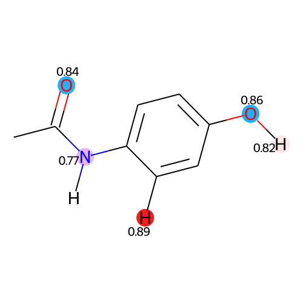

Molecular Features
""""""""""""""""""
Creates a dictionary of molecular features from a SMILES string. Features include *C-H donor strength* (sdc), *X-H donor strength* (sdx) where X includes any non-carbon atoms, *acceptor strength* (sda), *apolar contribution to delta g of hydration* (dga), *polar contribution to delta g of hydration* (dgp), *total delta G of hydration* (dgtot) which also accounts for an interaction term that is not included in the dictionary. Note that, if the SMILES cannot be processed, the function raises a *JazzyError*.

.. code-block:: python

   from jazzy.api import molecular_vector_from_smiles
   molecular_vector_from_smiles("CC(=O)NC1=CC=C(C=C1)O")

.. code-block:: python

   {'sdc': 4.2822,
    'sdx': 1.3955,
    'sa': 4.1564,
    'dga': -3.0161,
    'dgp': -51.2688,
    'dgtot': -54.5831}

The molecular donor strength can simply be produced by summing *C-H donor strength* (sdc) and *X-H donor strength* (sdx):

.. code-block:: python

   from jazzy.api import molecular_vector_from_smiles
   mol_vector = molecular_vector_from_smiles("CC(=O)NC1=CC=C(C=C1)O")
   mol_vector["sdx"] + mol_vector["sdc"]

.. code-block:: python

   5.7138

Gibbs Free Energy of Hydration
""""""""""""""""""""""""""""""
Calculates the Gibbs free energy of hydration (kJ/mol) from a SMILES string. If the SMILES cannot be processed, the function raises a *JazzyError*.

.. code-block:: python

   from jazzy.api import deltag_from_smiles
   deltag_from_smiles("CC(=O)NC1=CC=C(C=C1)O")

.. code-block:: python

   -54.5831

Atomic Features
"""""""""""""""
Creates a list (of tuples) of tuples of atomic features from a SMILES string. Features include *atomic number* (z), *formal charge* (q), *partial charge* (eeq), *atomic-charge dependent dynamic atomic polarizabilities* (alp), *hybridisation* (hyb), *number of lone pairs* (num_lp), *C-H donor strength* (sdc), *X-H donor strength* (sdx) where X includes any non-carbon atoms, *acceptor strength* (sda). Note that, if the SMILES cannot be processed, the function raises a *JazzyError*.

.. code-block:: python

   from jazzy.api import atomic_tuples_from_smiles
   atomic_tuples_from_smiles("[H]O[H]", minimisation_method="MMFF94")

.. code-block:: python

   [(('z', 8),
     ('q', 0),
     ('eeq', -0.6172),
     ('alp', 6.8174),
     ('hyb', 'sp3'),
     ('num_lp', 2),
     ('sdc', 0.0),
     ('sdx', 0.0),
     ('sa', 1.0)),
   ...
     (('z', 1),
     ('q', 0),
     ('eeq', 0.3086),
     ('alp', 1.3102),
     ('hyb', 'unspecified'),
     ('num_lp', 0),
     ('sdc', 0.0),
     ('sdx', 1.0),
     ('sa', 0.0))]

The APIs also include ``atomic_map_from_smiles`` which is analoguous to ``atomic_tuples_from_smiles`` yet it produces its output as a list of dictionaries:

.. code-block:: python

   from jazzy.api import atomic_map_from_smiles
   atomic_map_from_smiles("[H]O[H]", minimisation_method="MMFF94")

.. code-block:: python

   [{'z': 8,
     'q': 0,
     'eeq': -0.6172,
     'alp': 6.8174,
     'hyb': 'sp3',
     'num_lp': 2,
     'sdc': 0.0,
     'sdx': 0.0,
     'sa': 1.0,
     'idx': 0},
   ...
     {'z': 1,
     'q': 0,
     'eeq': 0.3086,
     'alp': 1.3102,
     'hyb': 'unspecified',
     'num_lp': 0,
     'sdc': 0.0,
     'sdx': 1.0,
     'sa': 0.0,
     'idx': 2}]

Hydrogen Bond Strength Depiction
""""""""""""""""""""""""""""""""
Creates an SVG rendering of the molecule with its atomistic hydrogen bond donor and acceptor strengths from an input SMILES string. Note that, if the SMILES cannot be processed, the function raises a *JazzyError*. The depiction function accepts parameters to:

1. Create a two- or three-dimensional depiction (e.g. ``flatten_molecule=True`` generates a 2D molecule)
2. Exclude specified types of strengths (e.g. ``ignore_sa=True`` excludes acceptor strengths from the rendering)
3. Apply minimum strength thresholds (e.g. ``sdc_threshold=0.7`` depicts *sdc* strengths only if greater than 0.7)
4. Configure the rounding digits on the image (e.g. ``rounding_digits=2`` rounds strengths to two digits)
5. Configure the output size (e.g. ``fig_size=[350,350]`` generates an image of 350x350 pixels)
6. Depict strengths without highlighting their atoms (e.g. ``highlight_atoms=False``)
7. Encode the image into base64 format (e.g. ``encode=True``)

.. code-block:: python

   from IPython.display import SVG
   from jazzy.api import atomic_strength_vis_from_smiles
   SVG(atomic_strength_vis_from_smiles(smiles="CC(=O)NC1=CC=C(C=C1)O",
                                       flatten_molecule=True,
                                       highlight_atoms=True,
                                       ignore_sdc=False,
                                       ignore_sdx=False,
                                       ignore_sa=False,
                                       sdc_threshold=0.7,
                                       sdx_threshold=0.6,
                                       sa_threshold=0.7,
                                       rounding_digits=2))

