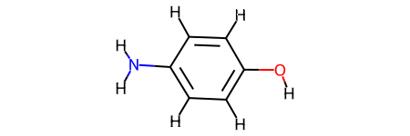

Jazzy calculates its descriptors using partial charges from kallisto and produces results that match the atomic indices generated by RDKit. This logic was conceived with the aim to facilitate the use and integration of Jazzy. This section reports some examples of how to use the core functionalities of the library.

RDKit and kallisto Molecules
""""""""""""""""""""""""""""
To run Jazzy from the core, you need to produce both an RDKit and kallisto molecules. The kallisto molecule is used to produce the descriptors, and the RDKit molecule is where the rest of the chemoinformatics happens. The easiest way to produce a valid RDKit molecule to use ``rdkit_molecule_from_smiles`` with a SMILES string as an input. The function creates an RDKit object, adds explicit hydrogens to it, generates an embedding, and optionally runs an energy minimisation method against it. Note that, if the SMILES cannot be processed, the function returns a *None*.

.. code-block:: python

   from jazzy.core import rdkit_molecule_from_smiles
   rdkit_molecule_from_smiles("NC1=CC=C(C=C1)O", minimisation_method="MMFF94")

Alternatively, if you want to use an MDL molfile, you can construct a similar logic directly with RDKit:

.. code-block:: python

   import rdkit
   rdkit_mol = rdkit.Chem.MolFromMolFile("../4_aminophenol.mol")   # Creates the RDKit object
   rdkit_mol = rdkit.Chem.AddHs(rdkit_mol, addCoords=True)         # Adds hydrogens and their coordinates
   rdkit_mol.__module__

.. code-block:: python

   'rdkit.Chem.rdchem'

Once you have an embedded RDKit molecule with explicit hydrogens, you can create its corresponding kallisto molecule:

.. code-block:: python

   from jazzy.core import rdkit_molecule_from_smiles, kallisto_molecule_from_rdkit_molecule
   rdkit_mol = rdkit_molecule_from_smiles("NC1=CC=C(C=C1)O", minimisation_method="MMFF94")
   kallisto_molecule_from_rdkit_molecule(rdkit_mol)

.. code-block:: python

   <kallisto.molecule.Molecule at 0x7f5e77c94340>

From Charges to Free Energy of Hydration
""""""""""""""""""""""""""""""""""""""""

Given that you have both RDKit and kallisto molecules, a set of functions can be called sequentially to produce partial charges, atomic polar strengths, and free energy of hydration components.

* **Partial Charges**

Jazzy wraps kallisto and maps its partial charges onto RDKit - i.e., the indices of the list of charges correspond to the atom indices in RDKit. This way, you can easily get results for your RDKit objects and carry on with your chemoinformatics logic.

.. code-block:: python

   from jazzy.core import rdkit_molecule_from_smiles, kallisto_molecule_from_rdkit_molecule, get_charges_from_kallisto_molecule
   rdkit_mol = rdkit_molecule_from_smiles("NC1=CC=C(C=C1)O", minimisation_method="MMFF94")
   kallisto_mol = kallisto_molecule_from_rdkit_molecule(rdkit_mol)
   get_charges_from_kallisto_molecule(kallisto_mol, charge=0)

.. code-block:: python

   [-0.6627001925559142, 0.11268080360767647, -0.0873075526419112, -0.10025584673427702, 0.11201856315343292, -0.07343308047161486, -0.08901274832446447, -0.4865928417376737, 0.26238853128287026, 0.2622190860687737, 0.11949194864178196, 0.11522856894442372, 0.13396962850629238, 0.11992126184542574, 0.2613838704151783]

* **Atomic Strengths**

The same principle described above applies to the generation of atomistic features: Jazzy creates a dictionary where keys are atom indices that match those in the RDKit molecule and values are dictionaries of features. Features include *atomic number* (z), *formal charge* (q), *partial charge* (eeq), *atomic-charge dependent dynamic atomic polarizabilities* (alp), *hybridisation* (hyb), *number of lone pairs* (num_lp), *C-H donor strength* (sdc), *X-H donor strength* (sdx) where X includes any non-carbon atoms, *acceptor strength* (sda).

.. code-block:: python

   from jazzy.core import rdkit_molecule_from_smiles, kallisto_molecule_from_rdkit_molecule
   from jazzy.core import get_covalent_atom_idxs, get_charges_from_kallisto_molecule, calculate_polar_strength_map
   rdkit_mol = rdkit_molecule_from_smiles("NC1=CC=C(C=C1)O", minimisation_method="MMFF94")
   kallisto_mol = kallisto_molecule_from_rdkit_molecule(rdkit_mol)
   atoms_and_nbrs = get_covalent_atom_idxs(rdkit_mol)
   kallisto_charges = get_charges_from_kallisto_molecule(kallisto_mol, charge=0)
   calculate_polar_strength_map(rdkit_mol, kallisto_mol, atoms_and_nbrs, kallisto_charges)

.. code-block:: python

   {
    0: {'z': 7,
        'q': 0,
        'eeq': -0.6627,
        'alp': 9.026,
        'hyb': 'sp2',
        'num_lp': 1,
        'sdc': 0.0,
        'sdx': 0.0,
        'sa': 1.1157},
    1: {'z': 6,
        'q': 0,
        'eeq': 0.1127,
        'alp': 8.469,
        ...
        'hyb': 'unspecified',
        'num_lp': 0,
        'sdc': 0,
        'sdx': 0.5973,
        'sa': 0}
   }

* **Molecular Strengths**

Atomic strengths are simply summed up to yield molecular strengths. Jazzy implements ``sum_atomic_map()`` within its `helpers`_ that does the job for you.

.. code-block:: python

   from jazzy.core import rdkit_molecule_from_smiles, kallisto_molecule_from_rdkit_molecule
   from jazzy.core import get_covalent_atom_idxs, get_charges_from_kallisto_molecule, calculate_polar_strength_map
   from jazzy.helpers import sum_atomic_map
   rdkit_mol = rdkit_molecule_from_smiles("NC1=CC=C(C=C1)O", minimisation_method="MMFF94")
   kallisto_mol = kallisto_molecule_from_rdkit_molecule(rdkit_mol)
   atoms_and_nbrs = get_covalent_atom_idxs(rdkit_mol)
   kallisto_charges = get_charges_from_kallisto_molecule(kallisto_mol, charge=0)
   atomic_map = calculate_polar_strength_map(rdkit_mol, kallisto_mol, atoms_and_nbrs, kallisto_charges)
   sum_atomic_map(atomic_map)

.. code-block:: python

   {'sdc': 2.2437, 'sdx': 2.111, 'sa': 1.999}

* **Free Energy of Hydration**

The calculation of the free energy of hydration requires: RDKit molecule, kallisto molecule, the atomic hydrogen bonding strengths map, and a set of free parameters that are specific to each free energy component. Jazzy comes already with a a set of `parameters`_. that we have derived by fitting the components against a set of experimental free energy of hydration values but you can replace them with your own parameters if you wish. Here we show an full example of how to calculate the delta hydration energy and its components for a SMILES string using the core functions.

If you are just interested in calculating the free energy of hydration without caring about the free parameters, we strongly advise to use directly the `Free Energy of Hydration API`_.

.. code-block:: python

   # First of all, set the parameters
   g0=1.884
   gs=0.0467
   gr=-3.643
   gpi1=-1.602
   gpi2=-1.174
   gd=-0.908
   ga=-16.131
   expd=0.50
   expa=0.34
   gi=4.9996
   f=0.514

.. code-block:: python

   from jazzy.core import rdkit_molecule_from_smiles, kallisto_molecule_from_rdkit_molecule
   from jazzy.core import get_covalent_atom_idxs, get_charges_from_kallisto_molecule, calculate_polar_strength_map
   from jazzy.core import calculate_delta_polar, calculate_delta_apolar, calculate_delta_interaction

   # Then, let's create the molecules and their atomic strengths
   smiles = "NC1=CC=C(C=C1)O"
   rdkit_mol = rdkit_molecule_from_smiles(smiles, minimisation_method="MMFF94")
   kallisto_mol = kallisto_molecule_from_rdkit_molecule(rdkit_mol)
   atoms_and_nbrs = get_covalent_atom_idxs(rdkit_mol)
   kallisto_charges = get_charges_from_kallisto_molecule(kallisto_mol, charge=0)
   atomic_map = calculate_polar_strength_map(rdkit_mol, kallisto_mol, atoms_and_nbrs, kallisto_charges)

   # Calculate individual terms and finally produce their sum
   dgp = calculate_delta_polar(atomic_map,
                               atoms_and_nbrs,
                               gd=gd,
                               ga=ga,
                               expd=expd,
                               expa=expa)

   dga = calculate_delta_apolar(rdkit_mol,
                                atomic_map,
                                g0=g0,
                                gs=gs,
                                gr=gr,
                                gpi1=gpi1,
                                gpi2=gpi2)

   dgi = calculate_delta_interaction(rdkit_mol,
                                    atomic_map,
                                    atoms_and_nbrs,
                                    gi=gi,
                                    expa=expa,
                                    f=f)

   print(dgp + dga + dgi)  # The sum of the terms yields the Free Energy of Hydration (kJ/mol)

.. code-block:: python

   -43.074539262505496

.. _helpers: https://github.com/AstraZeneca/jazzy/blob/master/src/jazzy/helpers.py
.. _parameters: https://github.com/AstraZeneca/jazzy/blob/master/src/jazzy/config.py
.. _Free Energy of Hydration API: https://jazzy.readthedocs.io/en/latest/cookbook.html#gibbs-free-energy-of-hydration
